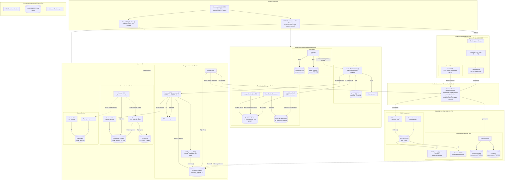

# Временный файл для оценки архитектурной схемы (Задание 10)

```mermaid
flowchart TD
    %% ===== 1. Клиенты и Входной периметр =====
    subgraph S_EDGE["Входной периметр"]
        Clients["Клиенты (Mobile KMP / Web SPA)<br/>+ локальный SQLite-кэш"]
        CDN["Edge CDN (CloudFront)<br/>раздача аудио TTS и статики"]
        Ingress["L4 IPVS + L7 Nginx + API Gateway<br/>(TLS 1.3, WAF, AuthN, маршрутизация)"]
        
        Clients --> Ingress
        Clients --> CDN
    end

    %% ===== 2. Домен пользователей и геймификации =====
    subgraph D_USER["Домен пользователей и геймификации"]
        subgraph S_AUTH["Auth Service"]
            AuthAPI["Auth API<br/>login / токены"]
            PostgresAuth[("PostgreSQL Auth<br/>аккаунты, хэши")]
            RedisSessions[("Redis Sessions<br/>токены (TTL 30d)")]
            
            AuthAPI -->|"R/W"| PostgresAuth
            AuthAPI -->|"R/W"| RedisSessions
        end

        subgraph S_USERS["Users Service"]
            UsersAPI["Users API (композиция)<br/>GET /user/progress (главная)"]
            PostgresUsers[("PostgreSQL Users<br/>профиль, настройки")]
            UsersCache["Кэш профиля"]
            
            UsersAPI -->|"R/W"| PostgresUsers
            UsersAPI -->|"R/W"| UsersCache
        end

        subgraph S_GAMIF["Gamification & Leagues Service"]
            GamifAPI["Leaderboard API<br/>GET /leaderboard"]
            GamifConsumer["Gamification Consumer"]
            LeagueWorker["League Worker (CronJob)"]
            RedisGamif[("Redis Gamification<br/>XP, стрик (HASH), лиги (ZSET)")]
            ScyllaGamif[("ScyllaDB Gamification<br/>xp_ledger (durable log)")]
            
            GamifConsumer -->|"W (HINCRBY)"| RedisGamif
            GamifConsumer -->|"W (ledger)"| ScyllaGamif
            LeagueWorker -->|"R/W (недельный сброс)"| RedisGamif
            GamifAPI -->|"R (Top-30)"| RedisGamif
            GamifAPI -.->|"fallback R (отказ Redis)"| ScyllaGamif
        end
        
        AuthAPI -.->|"async: инвалидация сессий"| UsersAPI
        UsersAPI -->|"R: очки и стрик"| GamifAPI
    end

    %% ===== 3. Домен обучения и контента =====
    subgraph D_LEARN["Домен обучения и контента"]
        subgraph S_PROGRESS["Progress & Practice Service"]
            LessonAPI["Lessons API (композиция)<br/>GET /lesson, POST /submit"]
            HLRRanker["HLR-ранжер (CPU)<br/>Spaced Repetition, min-heap"]
            OutboxRelay["Outbox Relay"]
            LessonCache["Fallback-кэш уроков"]
            ScyllaProgress[("ScyllaDB Progress<br/>прогресс, ошибки, θ, outbox")]
            
            LessonAPI --> HLRRanker
            LessonAPI -->|"R/W (атомарно)"| ScyllaProgress
            HLRRanker -->|"R (фичи, θ)"| ScyllaProgress
            OutboxRelay -->|"R (outbox)"| ScyllaProgress
            LessonAPI -->|"W"| LessonCache
            LessonAPI -.->|"fallback R"| LessonCache
        end

        subgraph S_CONTENT["Course Content Service"]
            ContentAPI["Content API<br/>каталог заданий"]
            PublishAPI["Publish API<br/>публикация + outbox"]
            MediaWorker["Media-воркер<br/>TTS (Amazon Polly)"]
            PostgresContent[("PostgreSQL Content<br/>курсы, задания, tts_meta")]
            S3Content[("S3 Content<br/>TTS Opus + статика")]
            
            ContentAPI -->|"R"| PostgresContent
            PublishAPI -->|"W (outbox)"| PostgresContent
            MediaWorker -->|"W (медиа)"| S3Content
            MediaWorker -->|"W (метаданные)"| PostgresContent
        end

        subgraph S_SEARCH["Search Service"]
            SearchAPI["Search API<br/>GET /courses"]
            Indexer["Воркер-индексатор"]
            OpenSearch[("OpenSearch<br/>индекс каталога")]
            
            SearchAPI -->|"R"| OpenSearch
            Indexer -->|"W"| OpenSearch
        end

        PublishAPI -.->|"async: content_events"| MediaWorker
        PublishAPI -.->|"async: content_events"| Indexer
        LessonAPI -->|"R: упражнения"| ContentAPI
    end

    %% ===== Междоменные связи =====
    UsersAPI -->|"R: текущий урок"| LessonAPI
    OutboxRelay -.->|"async: lesson_submitted"| GamifConsumer

    %% ===== 4. Медиа-инференс и сбор событий =====
    subgraph D_MEDIA["Медиа-инференс и события"]
        subgraph S_SPEECH["Speech Service (GPU EC2)"]
            Ingest["Приём аудио + libopus"]
            Conformer["Conformer-CTC + GoP (TensorRT)"]
            Sampler["Сэмплер 0,5%<br/>(99,5% drop in RAM)"]
            
            Ingest --> Conformer --> Sampler
        end
        
        subgraph S_EVENTS["Events Service"]
            EventsAPI["Events API<br/>POST /events (клиентские батчи)"]
        end
    end

    %% Входные потоки от периметра к сервисам
    Ingress --> D_USER
    Ingress --> D_LEARN
    Ingress -->|"speech/*"| Ingest
    CDN -.->|"origin miss (R)"| S3Content

    %% ===== 5. Событийная шина (Apache Kafka) =====
    subgraph S_KAFKA["Событийная шина (Apache Kafka KRaft)"]
        KafkaBus["Топики событий:<br/>• frontend_events (клиентские клики, сессии)<br/>• lesson_submitted (прогресс уроков)<br/>• speech_raw (0,5% аудио сэмплов)"]
    end

    OutboxRelay -->|"бэк-события"| KafkaBus
    EventsAPI -->|"фронт-события"| KafkaBus
    Sampler -->|"голос 0,5%"| KafkaBus

    %% ===== 6. Оффлайн-контур и аналитика =====
    subgraph S_OFFLINE["ОФФЛАЙН / NEAR-LINE КОНТУР"]
        subgraph S_DWH["DWH / Аналитика"]
            DWHConsumer["DWH-консьюмер<br/>батчи 20–50k"]
            ClickHouse[("ClickHouse DWH<br/>dwh_events")]
            Reconcile["Сверка front ↔ back<br/>+ ML-витрины"]
            
            DWHConsumer -->|"W (батчи)"| ClickHouse
            Reconcile -->|"R"| ClickHouse
        end

        subgraph S_ML_ARCHIVE["Оффлайн ML и Архив речи"]
            HLRTrainer["HLR-тренер (Spark / PyTorch)<br/>пересчёт весов θ"]
            MistakesBuilder["Mistakes Builder<br/>near-line срез ошибок"]
            SpeechArchiver["Speech Archiver"]
            ScyllaSpeech[("ScyllaDB Speech<br/>метаданные (TTL 90d)")]
            S3Speech[("S3 Speech<br/>аудиозаписи (TTL 90d)")]

            SpeechArchiver -->|"W"| S3Speech
            SpeechArchiver -->|"W"| ScyllaSpeech
            ClickHouse -->|"R"| HLRTrainer
            ClickHouse -->|"R"| MistakesBuilder
        end

        KafkaBus -->|"DWH events"| DWHConsumer
        KafkaBus -->|"speech_raw"| SpeechArchiver
    end

    %% Локальное обновление витрин Progress из ML
    HLRTrainer -.->|"W: веса θ"| ScyllaProgress
    MistakesBuilder -.->|"W: user_mistakes"| ScyllaProgress

    %% ===== 7. Контур наблюдаемости =====
    subgraph S_OBS["Контур наблюдаемости (DaemonSet)"]
        OtelAgent["OTel Collector + Vector"]
        ObsDB[("VictoriaMetrics • Loki • Tempo")]
        Grafana["Grafana + Alertmanager"]

        OtelAgent --> ObsDB --> Grafana
    end
```
